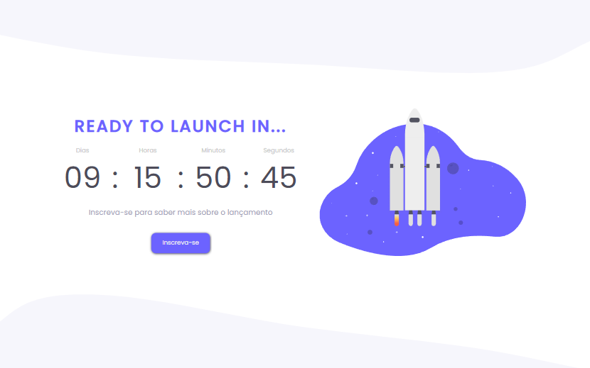
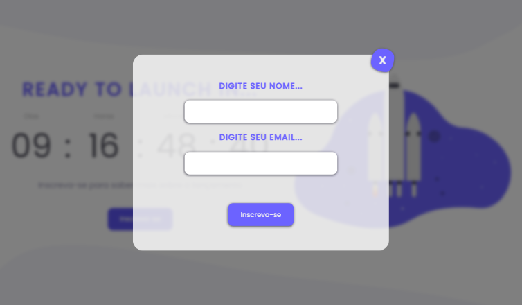
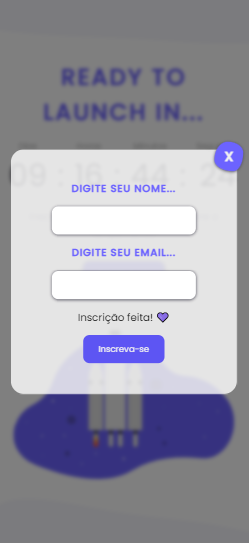

<h1 align="center"> 🚀 Countdown JS </h1>

    

"Countdown" Discover Challenge Resolution - RocketSeat

<h4 align="center"> 
	🚧  Finished ! 🚧
</h4>

## 💻 About the project

This is the solution to the challenge proposed in Discover - Rockeseat. In addition, I also made a modal with an interactive registration form and also made the page as responsive as possible.

<a href="https://countdownjsevemon.netlify.app/" target="_blank">
Click here to test !</a>

## 🎨 Interface

  

  
   

 

## 👩🏻 Autor

Made with 💜 by Evelyn Monteiro 👋

